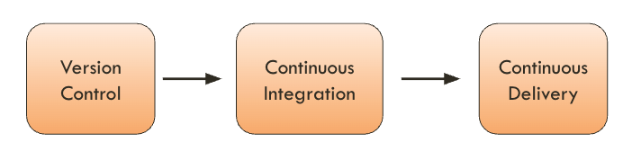

# BetCycle: A DevOps Quest From Exploration To Production

The purpose of this project is to explore the software development lifecycle through the deployment pipeline. I will use this project to share my knowledge, to explore tools and new approachs, for learning, and support my talks, posts, and other materials.  

The deployment pipeline, my favorite technical and cultural tool, will guide us in this quest from writing code in the local environment to the production environment.

Such quest includes the following elements:
- Application
- Deployment pipeline (aka CI/CD) 
- Infrastructure 

> ℹ️ _During the quest I will add information regarding each of the elements._  

## Application

TBD

## Deployment Pipeline

> A deployment pipeline should enable __collaboration__ between the __various groups involved in delivering software__ and provide everyone __visibility about the flow of changes__ in the system, together with a thorough audit trail.
>
> by Martin Fowler, [Deployment Pipeline](https://martinfowler.com/bliki/DeploymentPipeline.html)

A deployment pipeline is a set of automated steps that move code changes from development to production.

- Build the application, run tests, perform code analysis, and deploy the code into the different target environments.
- We want to release quickly, reliably, and with high quality. 

### Pipeline diagram

Below is a simple diagram showing the three core stages of the deployment pipeline: Version Control → CI → CD.

## Infrastructure

TBD
